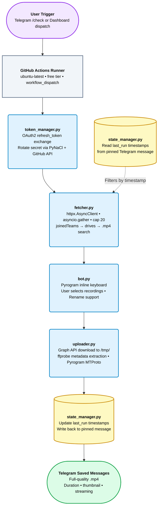

# TeamsLeech Bot — The Complete Guide

> **How one student eliminated bandwidth-throttled lecture downloads entirely,
> built a zero-cost automation pipeline on Microsoft's own infrastructure,
> and delivered university recordings directly to Telegram — without touching
> local storage or spending a single dollar.**

---

## Table of Contents

1. [The Problem Worth Solving](#1-the-problem-worth-solving)
2. [What TeamsLeech Actually Does](#2-what-teamsleech-actually-does)
3. [Why This Stack Is the Right Answer](#3-why-this-stack-is-the-right-answer)
4. [Architecture Deep-Dive](#4-architecture-deep-dive)
   - 4.1 [System Overview](#41-system-overview)
   - 4.2 [Authentication Layer — token_manager.py](#42-authentication-layer--token_managerpy)
   - 4.3 [Discovery Engine — fetcher.py](#43-discovery-engine--fetcherpy)
   - 4.4 [Telegram Interface — bot.py](#44-telegram-interface--botpy)
   - 4.5 [Upload Pipeline — uploader.py](#45-upload-pipeline--uploaderpy)
   - 4.6 [State Persistence — state_manager.py](#46-state-persistence--state_managerpy)
   - 4.7 [Control Dashboard — docs/index.html](#47-control-dashboard--docsindexhtml)
5. [Prerequisites](#5-prerequisites)
6. [Full Setup Walkthrough](#6-full-setup-walkthrough)
   - 6.1 [Step 1 — Fork the Repository](#61-step-1--fork-the-repository)
   - 6.2 [Step 2 — Capture the Microsoft Refresh Token](#62-step-2--capture-the-microsoft-refresh-token)
   - 6.3 [Step 3 — Generate the Telegram Session String](#63-step-3--generate-the-telegram-session-string)
   - 6.4 [Step 4 — Add GitHub Secrets](#64-step-4--add-github-secrets)
   - 6.5 [Step 5 — Configure Your Subjects](#65-step-5--configure-your-subjects)
   - 6.6 [Step 6 — Deploy the Dashboard](#66-step-6--deploy-the-dashboard)
   - 6.7 [Step 7 — First Run](#67-step-7--first-run)
7. [Dashboard and Bot Usage Guide](#7-dashboard-and-bot-usage-guide)
   - 7.1 [The Dashboard](#71-the-dashboard)
   - 7.2 [The Telegram Bot](#72-the-telegram-bot)
8. [Production Metrics](#8-production-metrics)
9. [Lessons Learned and What I Would Do Differently](#9-lessons-learned-and-what-i-would-do-differently)
10. [Troubleshooting Reference](#10-troubleshooting-reference)
11. [Project Evolution Timeline](#11-project-evolution-timeline)
12. [Security Model Summary](#12-security-model-summary)
13. [Contributing](#13-contributing)
14. [Conclusion](#14-conclusion)

---

## 1. The Problem Worth Solving

University lecture recordings are large. A single 90-minute Teams session regularly
produces a `.mp4` file between 400 MB and 1.5 GB. For students with limited or
metered internet — which is most students in most countries — downloading that file
directly is either painfully slow, prohibitively expensive, or both.

The standard workflow looks like this:

1. Log into Microsoft Teams.
2. Navigate to the correct channel or meeting tab.
3. Find the recording.
4. Click download.
5. Wait. And wait. And wait.
6. Hope the connection doesn't drop at 87%.

Even when the download eventually completes, the file lands on a device that may
already be short on storage. If a student switches devices — from laptop to phone,
from home to library — the recording isn't there. There is no sync. There is no
push notification. There is no organization. Teams simply stores recordings in a
SharePoint drive and leaves the rest to you.

The inefficiency is layered: manual discovery, manual download, local storage
consumption, no cross-device access, no organization by subject. Every single
lecture, every single time.

The question that started this project was not _"can I automate this"_ — the answer
to that is obviously yes. The question was: **can I automate this in a way that
eliminates the bandwidth problem entirely, not just schedules it for off-peak hours?**

The answer turned out to be yes, and the solution was hiding in plain sight inside
Microsoft's own infrastructure.

---

## 2. What TeamsLeech Actually Does

TeamsLeech Bot is a single-user automation pipeline with one job: find new lecture
recordings in Microsoft Teams and deliver them to Telegram Saved Messages — without
the local device ever downloading a single byte of video data.

The key insight is architectural. Instead of running on your laptop or phone,
the entire pipeline executes on a GitHub Actions runner — a free, ephemeral,
cloud-hosted Ubuntu machine that sits on Microsoft Azure's own network. When that
runner calls the Microsoft Graph API to download a recording, it is pulling from
Microsoft's datacenter to Microsoft's datacenter. The data travels at datacenter
speeds (~148 MB in 5 seconds) and never touches your local internet connection
at all.

When the file is then uploaded from the runner to Telegram's servers via the
MTProto protocol, that upload happens at similar datacenter-to-server speeds
(~238 MB in 7 seconds). The resulting file lives permanently in your Telegram
Saved Messages — organized, searchable, playable on any device — without ever
passing through your phone or laptop.

**What the bot does, in order:**

- Exchanges a stored Microsoft OAuth2 refresh token for a fresh access token
  and immediately rotates the old token into GitHub Secrets for the next run.
- Scans all Microsoft Teams groups the account belongs to (up to 98 teams
  in production) using concurrent async HTTP requests via `httpx.AsyncClient`
  with `asyncio.gather`, completing the full scan in under 90 seconds.
- Filters scanned teams against a configurable list of subjects and keywords
  defined in `subjects_config.json`.
- Identifies `.mp4` files created since the last run (or within a specified
  date range), using per-subject timestamps stored persistently in a pinned
  Telegram message.
- Presents matching recordings to the user as an interactive Telegram
  checklist — with file size, date, time, subject, and team name — and
  waits for explicit selection.
- Downloads selected files to the GitHub Actions runner's ephemeral disk
  in `/tmp/`, runs `ffprobe` to extract video duration and dimensions,
  and uploads each file to Telegram Saved Messages via Pyrogram MTProto
  with correct metadata so Telegram's player renders the scrubber and
  timeline correctly.
- Updates the per-subject `last_run` timestamps so the next run only
  surfaces recordings that are genuinely new.

**What it does not do:**

TeamsLeech is not a multi-user SaaS. It is not a background daemon. It does not
watch Teams in real time. It does not compress, transcode, or subtitle videos.
It does not require administrative Azure AD app registration. It runs only when
explicitly triggered — either from the GitHub Actions tab, from the Telegram bot,
or from the web dashboard — and it runs in under 10 minutes from trigger to delivery.

---

## 3. Why This Stack Is the Right Answer

Before diving into the architecture, it is worth understanding why each technology
choice was made. These are not default choices or convenient defaults — each one
solves a specific constraint.

**GitHub Actions as the execution engine** eliminates infrastructure cost entirely.
GitHub's free tier provides 2,000 minutes of compute per month on `ubuntu-latest`
runners. TeamsLeech uses roughly 200 minutes per month — 10% of the available
quota — which means the bot could run five times as often and still cost nothing.
There is no server to maintain, no Docker container to keep alive, no billing
alarm to set. The runner is provisioned fresh for each run, completes its work,
and is recycled. This also means the bot inherits all the reliability, uptime,
and patching that GitHub provides for free.

**Microsoft Graph API over HAR-captured credentials** bypasses the primary
obstacle for student deployments: IT-managed Azure AD tenants block third-party
app registrations. By capturing the token flow used by the Teams Web Client itself
(using the Azure CLI client ID `04b07795-8ddb-461a-bbee-02f9e1bf7b46` and the
Teams Web Client origin header), the bot authenticates with standard student
credentials and does not require administrator approval. This is the same
authentication path that the browser uses when you open Teams in Chrome.

**Pyrogram MTProto over the Telegram Bot API HTTP endpoint** is the only way
to send files larger than 50 MB to Telegram without a paid business account.
The Bot API HTTP endpoint is hard-limited to 50 MB uploads. Pyrogram speaks
the native MTProto protocol, which supports files up to 2 GB. In practice,
lecture recordings average 400–800 MB, so this is not an edge case — it is
the core requirement.

**PyNaCl sealed-box encryption for token rotation** means the bot can write
its own rotated refresh token back into GitHub Secrets without storing the
token in plaintext anywhere. The GitHub Secrets API requires the secret to
be encrypted with the repository's public key using libsodium's sealed box
construction. PyNaCl provides this in three lines of Python. The result is
that the refresh token self-heals every run with no human intervention.

**A private GitHub Gist as the credential store for the dashboard** avoids
the need for any backend server. The dashboard is a static HTML file on
GitHub Pages. It cannot securely store credentials. Instead, credentials
are encrypted with AES-256-GCM using a PBKDF2-derived key and stored in
a private Gist. The dashboard fetches the encrypted blob, decrypts it in
browser memory using the Web Crypto API, and never writes anything to disk.
The `GIST_READ_TOKEN` baked into the HTML source is read-only — an attacker
who reads the source gets an encrypted blob they cannot decrypt without the
master password.

**A pinned Telegram message as the state database** eliminates the last
remaining infrastructure dependency. GitHub Actions runners are ephemeral —
they have no persistent disk between runs. The naive solution is to use
GitHub Actions Artifacts to save and restore a state file. The problem is
that artifacts have a 90-day retention limit and require an extra API call
per run. The TeamsLeech solution stores per-subject `last_run` timestamps
as a JSON blob in a pinned message in the user's own Telegram chat. The
bot reads this message on startup, updates it after each successful upload,
and the state survives indefinitely — no retention limits, no extra
infrastructure, zero cost.

---

## 4. Architecture Deep-Dive

### 4.1 System Overview

The full pipeline, from trigger to delivery:



Each module is independently testable and has a single, well-defined responsibility.
`main.py` is the orchestrator that wires them together, reading environment variables
injected by GitHub Actions and creating the Pyrogram client.

---

### 4.2 Authentication Layer — token_manager.py

Microsoft Graph API access tokens expire in approximately 87 minutes. Refresh
tokens expire in approximately 90 days. The authentication layer solves both
lifetimes automatically.

**Token exchange** calls Microsoft's OAuth2 v2.0 token endpoint with the stored
refresh token, the Azure CLI client ID, and the Graph API scope. On success, it
receives a fresh access token (used immediately for the current run) and a new
refresh token (which replaces the old one).

**Token rotation** encrypts the new refresh token using PyNaCl's sealed box
construction against the repository's libsodium public key, then writes the
encrypted value to the `TEAMS_REFRESH_TOKEN` GitHub Secret via the GitHub Actions
Secrets API. This means the stored token is always the most recently issued one —
the 90-day clock resets on every run.

**Error classification** distinguishes between two failure modes:

- `TokenExpiredError` — raised when Microsoft returns `invalid_grant`, meaning
  the refresh token has fully expired (not just the access token). This requires
  a human to run `scripts/get_teams_token.py` and issue a new token via the
  device login flow. The bot catches this and drops into a reauth-only mode,
  sending the user a `/reauth` guide via Telegram.

- `TokenExchangeError` — raised for all other failures (network errors, bad
  responses, missing fields). These are typically transient and the run can
  be retried.

The `get_access_token()` function is the single public entry point. It reads
`TEAMS_REFRESH_TOKEN`, `GH_PAT`, and `GITHUB_REPOSITORY` from environment
variables, performs the exchange, rotates the secret, and returns the access token.
`main.py` calls this once at startup and passes the access token to all subsequent
modules.

---

### 4.3 Discovery Engine — fetcher.py

The fetcher's job is to turn a list of subject keywords into a list of `.mp4`
recording metadata objects. It does this in three phases, all running concurrently.

**Phase 1 — Joined teams discovery**

A single call to `GET /me/joinedTeams` with `@odata.nextLink` pagination retrieves
every Microsoft Teams group the authenticated account belongs to. In production,
this is 98 teams. The full list is fetched once per run and held in memory —
no per-team repeated calls to this endpoint.

**Phase 2 — Team matching**

Each team's `displayName` is compared against the keyword arrays in
`subjects_config.json`. Short alphabetic keywords (e.g. `"mis"`, `"or"`) use
word-boundary regex matching (`\b{keyword}\b`) to avoid false positives — without
this guard, `"or"` would match `"information"` and `"promise"`. Longer multi-word
keywords use substring matching. A team can match multiple subjects.

**Phase 3 — Concurrent drive search**

For each matched team, three Graph API calls are made: get the SharePoint site
root, list the site's drives, and search each drive for `.mp4` files. All teams
across all subjects fire concurrently using `asyncio.gather`, governed by an
`httpx.Limits` cap of 20 simultaneous connections. This cap was chosen empirically
— 98 teams × ~3 calls each = ~300 potential simultaneous requests, which would
exceed Graph API rate limits. At 20 concurrent connections, the full scan completes
in under 90 seconds and does not trigger throttling.

Date filtering is applied per file:

- **Default (no date filter):** files are included only if their `createdDateTime`
  is strictly after the per-subject `last_run` timestamp from `state_manager`.
- **Single date:** files are included only if `createdDateTime` matches the
  specified YYYY-MM-DD date exactly.
- **Date range:** files are included if `createdDateTime` falls within the
  specified start and end dates (inclusive).

The result is a dict mapping subject name to a list of recording metadata objects,
each containing: filename, size in MB, creation date and time, drive ID, item ID,
team name, subject name, and duration in milliseconds (when available from the
Graph API's `video` metadata field).

---

### 4.4 Telegram Interface — bot.py

The bot module handles all user interaction using Pyrogram inline keyboards and
callback queries. It maintains in-memory state per chat ID using Python dicts —
no database, no Redis, no session files. State is cleared when a session ends
(upload complete, cancel pressed, or new `/check` issued).

**Subject selection keyboard** presents all configured subjects as a 3-column
inline keyboard grid, plus a full-width "Check All (since last run)" button.
Tapping a single subject prompts the user to specify a date or date range before
scanning — this avoids accidentally scanning all of history and returning thousands
of results.

**Date input parsing** accepts multiple natural-language formats:

| Input format               | Parsed result                 |
| -------------------------- | ----------------------------- |
| `2026-04-01`               | Single date                   |
| `2026-04-01 to 2026-04-07` | Date range                    |
| `today`                    | Current UTC date              |
| `this week`                | Monday–Sunday of current week |

Date ranges are validated for logical consistency (start ≤ end) and capped at
30 days to prevent runaway API calls.

**Recording checklist** presents each result as a numbered entry showing: team
name, date and time, file size, and filename. Each entry has a checkbox button
(☐/☑) and a rename button (✏️). Users can toggle individual recordings, select
all, or deselect all. The upload button dynamically reflects the current selection
state — "tap a recording to select" when nothing is checked, or the total count
and size when selections exist.

**Rename flow** intercepts the next text message the user sends after tapping ✏️
and uses it as the new filename for that recording. If the user taps ✏️ on a
second recording while a rename is still pending, the previous rename is cancelled
cleanly before starting the new one — no dangling state.

**Upload progress** is streamed live into the status message as uploads proceed.
A progress bar (`[████░░░░░░] 40% · 12.3 MB/s`) updates every 5% of each file's
upload progress. On file completion, a separate "✅ filename uploaded — 487 MB in
2m 04s" message is sent. On all uploads complete, the status message is edited
to show the final summary.

---

### 4.5 Upload Pipeline — uploader.py

The uploader implements a producer/consumer async queue that overlaps downloading
and uploading. While one file is being uploaded to Telegram (consumer), the next
file is being downloaded from Graph API (producer). This eliminates the sequential
download-then-upload latency for multi-file batches.

**Download phase** streams the file from Microsoft Graph API to a temporary
file in `/tmp/` using Python's `requests` library with `stream=True` in 10 MB
chunks. The Graph API returns a 302 redirect to a CDN URL — `allow_redirects=True`
handles this transparently.

**Metadata extraction** runs `ffprobe` via `subprocess` on the downloaded file
before upload. `ffprobe` extracts:

- Video duration in seconds (fallback: 0, which causes Telegram to show 0:00)
- Video width and height in pixels (fallback: 1280×720)

These values are passed explicitly to Pyrogram's `send_video()`. Without them,
Telegram displays "0:00" in the scrubber and some clients refuse to play the
file inline, requiring users to download it locally and clear the Telegram cache.
With them, the file plays natively in the Telegram player with correct duration,
scrubber, and quality indicators.

**Thumbnail extraction** runs `ffmpeg` to capture a JPEG frame at the 2-second
mark of the video. This thumbnail is passed to `send_video()` as the `thumb`
parameter, giving the recording a meaningful preview image in the Telegram message
instead of a generic video icon.

**Upload phase** uses Pyrogram's `send_video()` with `supports_streaming=True`,
which instructs Telegram to process the video for adaptive streaming. If `send_video`
raises a `BadRequest` (indicating codec incompatibility), the uploader falls back
to `send_document()`, which sends the file as a raw download without playback
processing.

**State update** happens immediately after each successful upload. The
per-subject `last_run` timestamp is updated to the recording's creation datetime,
ensuring that exactly this recording — not just "the time of the run" — sets the
new baseline. This prevents edge cases where two recordings from the same subject
share a date and one gets uploaded but the other is lost because the timestamp
advances past both.

---

### 4.6 State Persistence — state_manager.py

GitHub Actions runners have no persistent disk between runs. Every file written
during a run is gone when the runner shuts down. TeamsLeech needs to remember, for
each subject, the timestamp of the most recently delivered recording — so it knows
where to start looking on the next run.

The solution uses a pinned message in the user's Telegram chat as a free, persistent,
unlimited key-value store.

The state message looks like this in Telegram:

```
#TEAMSLEECH_STATE
⚠️ DO NOT DELETE THIS MESSAGE
This acts as the database for the bot.

=====JSON_START=====
{
  "advanced_database": "2026-04-01T10:30:00+00:00",
  "auditing": "2026-03-28T14:15:00+00:00",
  "operations_research": "2026-04-03T09:00:00+00:00"
}
=====JSON_END=====
```

`TelegramStateManager` reads this message on startup by checking the chat's
pinned message for the `#TEAMSLEECH_STATE` tag. It parses the JSON block between
the delimiters and loads it into an in-memory cache. All `get_last_run()` calls
during the run read from this cache — no Telegram API calls after initialization.
All `save_last_run()` calls update the cache and immediately write the entire
updated JSON blob back to the pinned message via `edit_message_text()`.

If the pinned message is missing or malformed, the state manager initializes with
an empty cache (equivalent to "no history") and creates a new state message,
pinning it automatically.

---

### 4.7 Control Dashboard — docs/index.html

The dashboard is a single HTML file served via GitHub Pages. It requires no
backend, no server, and no infrastructure beyond the repository that already exists.

**Security model:**

```
Private GitHub Gist
  └── teamsleech_credentials.json
        salt: base64
        iv: base64
        ciphertext: base64  ← AES-256-GCM encrypted with PBKDF2-derived key
                                310,000 iterations, SHA-256

Dashboard (browser memory only)
  └── fetch Gist → decrypt with master password → store gh_pat, bot_token, chat_id
        never written to disk, never to localStorage, cleared on lock
```

The `GIST_ID` and `GIST_READ_TOKEN` values baked into the HTML source are not
secrets. `GIST_ID` is just an identifier. `GIST_READ_TOKEN` can only read the
Gist — it cannot write to it, cannot access the repository, and cannot trigger
workflows. The encrypted blob it exposes is useless without the master password.

**Biometric unlock:**

On the first successful password-based unlock, the dashboard calls
`navigator.credentials.create()` with `authenticatorAttachment: "platform"` to
register a WebAuthn credential tied to the device's secure enclave. The credential
ID (not any secret) is stored in `localStorage`. On subsequent visits, the user
taps their fingerprint or face sensor — the browser calls `navigator.credentials.get()`,
the device verifies the biometric, and the dashboard proceeds directly to password
decryption. The master password itself is still required for decryption — biometric
only gates access to the unlock form, it does not store or bypass the password.

**Polling architecture:**

The dashboard uses a layered polling strategy to avoid false failure states:

- **Normal polling:** every 10 seconds when no run is active.
- **Fast polling (post-dispatch):** exponential backoff starting at 3 seconds,
  increasing to 6s → 10s → 15s and staying at 15s thereafter. This handles the
  GitHub Actions cold-start window (~20–40 seconds between dispatch and the run
  appearing in the API).
- **90-second timeout window:** after dispatching a run, the dashboard waits up
  to 90 seconds for the run to appear in the API before switching to slow polling.
  It does not show an error during this window — a 204 response from the dispatch
  endpoint is treated as ground truth that the run was accepted.

**Live step tracker:**

During an active run, the dashboard polls `GET /repos/.../actions/runs/{id}/jobs`
every 2 seconds and renders each step with its real-time status:

| Step status          | Icon        | Row style            |
| -------------------- | ----------- | -------------------- |
| `in_progress`        | ⏳ spinning | Purple, nudged right |
| `completed: success` | ✅          | Green                |
| `completed: failure` | ✗           | Red                  |
| `completed: skipped` | →           | Muted                |
| `queued`             | ○           | Dimmed               |

**Token expiry detection:**

When a run fails, the dashboard distinguishes between token expiry and generic
failure by inspecting the step-level data from the jobs endpoint. If the
"Validate secrets present" step failed, or if a step at position 1–3 failed
(meaning the run died before reaching `main.py`), the dashboard renders an
orange `TOKEN EXPIRED` state with a `/reauth` prompt — rather than the generic
red `FAILED` state, which would not tell the user what to do next.

---

## 5. Prerequisites

### Accounts

| Account           | Required for                                | Cost |
| ----------------- | ------------------------------------------- | ---- |
| GitHub (any plan) | Hosting code, running Actions, GitHub Pages | Free |
| Telegram account  | Bot interface, file delivery, state storage | Free |
| Microsoft account | Teams access (existing university account)  | Free |

### Tokens and Credentials to Collect

Before starting setup, you will need to gather the following. Each item's
source is explained in the setup steps that follow.

| Credential            | Where to get it                            | Notes                                           |
| --------------------- | ------------------------------------------ | ----------------------------------------------- |
| `TEAMS_REFRESH_TOKEN` | `scripts/get_teams_token.py`               | Captured via device login flow                  |
| `TELEGRAM_SESSION`    | `scripts/generate_session.py`              | Pyrogram session string                         |
| `TELEGRAM_API_ID`     | [my.telegram.org](https://my.telegram.org) | Numeric app ID                                  |
| `TELEGRAM_API_HASH`   | [my.telegram.org](https://my.telegram.org) | 32-character hash                               |
| `TELEGRAM_BOT_TOKEN`  | [@BotFather](https://t.me/botfather)       | `123456:ABC-DEF...` format                      |
| `TELEGRAM_CHAT_ID`    | [@userinfobot](https://t.me/userinfobot)   | Your numeric user ID                            |
| `GH_PAT`              | GitHub → Settings → Developer Settings     | Needs `secrets:write` scope                     |
| `SUBJECTS_JSON`       | Your `subjects_config.json` content        | Optional — overrides the config file at runtime |

### Local Tools (One-Time Only)

```bash
# Python 3.11 or later required
python --version

# Install dependencies for the setup scripts
pip install pyrogram python-dotenv cryptography requests

# ffmpeg is needed locally only for scripts/generate_session.py
# Most systems already have it; if not:
# macOS:   brew install ffmpeg
# Ubuntu:  sudo apt install ffmpeg
# Windows: https://ffmpeg.org/download.html
```

---

## 6. Full Setup Walkthrough

### 6.1 Step 1 — Fork the Repository

Navigate to `https://github.com/AhmedTyson/TeamsLeech-Bot` and click **Fork**.
Keep the default fork name or rename it — the workflow does not depend on the
repository name.

Clone your fork locally:

```bash
git clone https://github.com/<your-username>/TeamsLeech-Bot.git
cd TeamsLeech-Bot
```

---

### 6.2 Step 2 — Capture the Microsoft Refresh Token

This is the only step that requires logging into your Microsoft account interactively.
It needs to be done once now, and again approximately every 90 days if the token
expires and auto-rotation has not kept it alive.

```bash
python scripts/get_teams_token.py
```

The script will print something like:

```
ACTION REQUIRED:
1. Open your browser and go to: https://microsoft.com/devicelogin
2. Enter this code: ABCD-EFGH
Waiting for you to log in...

✅ Successfully authenticated!

Your new refresh token is:

1.ATkAalg1e43RX...  (very long string)

Copy this token and use it to update your TEAMS_REFRESH_TOKEN GitHub Secret.
```

Copy the entire refresh token. It is long — typically 1,000–2,000 characters.
Do not close the terminal until you have saved it.

> **What this script does:** It uses Microsoft's OAuth2 device code flow with
> the Azure CLI client ID. Your university credentials are entered directly on
> Microsoft's login page — the script never sees your password. The resulting
> refresh token is an opaque string that grants delegated access to your account's
> Graph API scopes. Microsoft issues a new one on every token exchange, which is
> why auto-rotation is critical.

---

### 6.3 Step 3 — Generate the Telegram Session String

Pyrogram needs a session string to act as your Telegram user account (not as a
bot — as you). This is required to upload files up to 2 GB via MTProto.

First, get your API credentials from Telegram:

1. Go to [https://my.telegram.org](https://my.telegram.org) and log in.
2. Click **API development tools**.
3. Create a new application (the name and description do not matter).
4. Copy the `api_id` (a number like `12345678`) and `api_hash` (a 32-character hex string).

Create a `.env` file in the project root:

```env
TELEGRAM_API_ID=your_api_id_here
TELEGRAM_API_HASH=your_api_hash_here
```

Then run the session generator:

```bash
python scripts/generate_session.py
```

The script will ask for your phone number, send a login code to your Telegram
account, and print a session string that looks like:

```
BQABAADxHk3...  (very long base64 string)
```

Copy the entire string. This becomes `TELEGRAM_SESSION` in GitHub Secrets.

> **Security note:** The session string grants full access to your Telegram account.
> Treat it like a password. Store it in GitHub Secrets — never commit it to the
> repository or share it. It is stored encrypted by GitHub and only injected into
> the runner at runtime.

---

### 6.4 Step 4 — Add GitHub Secrets

Navigate to your forked repository on GitHub:

**Settings → Secrets and variables → Actions → New repository secret**

Add each of the following secrets:

| Secret name           | Value                             | Where it comes from          |
| --------------------- | --------------------------------- | ---------------------------- |
| `TEAMS_REFRESH_TOKEN` | The long token from Step 2        | `get_teams_token.py` output  |
| `TELEGRAM_SESSION`    | The long string from Step 3       | `generate_session.py` output |
| `TELEGRAM_API_ID`     | Your numeric API ID               | my.telegram.org              |
| `TELEGRAM_API_HASH`   | Your 32-char API hash             | my.telegram.org              |
| `TELEGRAM_BOT_TOKEN`  | Your bot token                    | @BotFather                   |
| `TELEGRAM_CHAT_ID`    | Your numeric user ID              | @userinfobot                 |
| `GH_PAT`              | Your GitHub personal access token | See below                    |

**Creating the GH_PAT:**

Go to GitHub → **Settings → Developer Settings → Personal access tokens →
Tokens (classic) → Generate new token**.

Select the following scopes:

- `repo` → `secrets` (write access to repository secrets)

Copy the generated token immediately — GitHub will not show it again.

> The `GH_PAT` is needed for token auto-rotation. If it is not set, the bot
> will still work but will warn you on each run that `TEAMS_REFRESH_TOKEN` will
> not auto-rotate, and you will need to refresh it manually every 90 days.

---

### 6.5 Step 5 — Configure Your Subjects

Open `subjects_config.json` in the repository root. Replace the default subjects
with your own course names and keywords:

```json
{
  "subjects": [
    {
      "name": "Full Course Name",
      "short": "Short Label for Telegram button",
      "keywords": [
        "exact course name as it appears in Teams",
        "abbreviated version",
        "course code",
        "professor name if relevant"
      ]
    }
  ]
}
```

**Keyword matching rules:**

- Keywords are matched against the `displayName` field of each Microsoft Teams group.
- Short alphabetic keywords (e.g. `"mis"`, `"or"`) use word-boundary matching,
  so `"or"` will not match `"information"` or `"organization"`.
- Longer multi-word keywords use substring matching.
- Matching is case-insensitive.
- If you are unsure what your Teams groups are named, run the bot once with
  a catch-all keyword like `"lecture"` and check what gets returned.

A well-configured `subjects_config.json` is the most important factor in whether
the bot finds the right recordings. If the bot returns zero results, the first
thing to check is whether the keywords match the actual Teams group names.

---

### 6.6 Step 6 — Deploy the Dashboard (Optional)

The dashboard is optional — the bot works entirely through Telegram without it.
But if you want a web interface to trigger and monitor runs, follow these steps.

**6.6.1 — Run the setup script:**

```bash
pip install cryptography requests
python scripts/setup_gist.py
```

The script will prompt you for:

- Your `GH_PAT` (the same one from Step 4)
- A separate `GIST_READ_TOKEN` — a new PAT with only `gist` (read) scope
- Your `TELEGRAM_BOT_TOKEN`
- Your `TELEGRAM_CHAT_ID`
- A master password of your choice (this is the password you will enter on the
  dashboard unlock screen — store it in a password manager)

The script will encrypt your credentials with AES-256-GCM and create a private
GitHub Gist. It will print two values:

```
GIST_ID = "32d9c1c37fd6140aa65e..."
GIST_READ_TOKEN = "ghp_xxxxxxxxxxxxxx"
```

**6.6.2 — Paste into the dashboard source:**

Open `docs/index.html`. Near the top of the `<script>` section, find:

```javascript
const GIST_ID = "PASTE_GIST_ID_HERE";
const GIST_READ_TOKEN = "PASTE_GIST_READ_TOKEN_HERE";
```

Replace both placeholder values with the values printed by `setup_gist.py`.

**6.6.3 — Enable GitHub Pages:**

In your forked repository, go to:

**Settings → Pages → Source → Deploy from a branch → Branch: `main` → Folder: `/docs`**

Click Save. GitHub will build and deploy the dashboard. After 1–2 minutes, it
will be accessible at:

```
https://<your-username>.github.io/TeamsLeech-Bot
```

**6.6.4 — Set up biometric unlock:**

Open the dashboard URL on your phone or laptop, enter the master password once
to unlock, and when your browser prompts to save the credential, accept it.
From that point on, Face ID or fingerprint will unlock the dashboard on that
device without re-entering the password.

---

### 6.7 Step 7 — First Run

**Option A — GitHub Actions tab:**

1. Go to your repository on GitHub.
2. Click the **Actions** tab.
3. Select **TeamsLeech Bot** from the left sidebar.
4. Click **Run workflow** → Leave mode as `normal` → Click the green **Run workflow** button.

**Option B — Dashboard:**

Open the dashboard URL, unlock it, and tap **Initialize Run**.

**Option C — Telegram:**

Open Telegram, find your bot (search for it by the username you set in BotFather),
and send `/check`.

> **First run behavior:** The first time the bot runs with no prior state, all
> three `last_run` timestamps default to `datetime.min` (the earliest possible
> datetime). This means the bot will find _all_ recordings across all matched
> teams, not just recent ones. If your Teams groups have many old recordings,
> the checklist will be very long. This is expected — select only what you want
> and let the rest go. The next run will only show recordings created after the
> ones you uploaded.

---

## 7. Dashboard and Bot Usage Guide

### 7.1 The Dashboard

The dashboard URL is `https://<your-username>.github.io/TeamsLeech-Bot`.

**Unlocking:**

Enter your master password on the unlock screen and press **Access Console**
(or Enter). If biometric is set up on this device, you will be prompted to
use Face ID or fingerprint first before decryption proceeds. On incorrect
password, the field clears and the error is shown — the incorrect attempt is
not logged or rate-limited (the decryption failure itself is the rate limit,
since PBKDF2 with 310,000 iterations takes ~200ms per attempt).

**Telemetry block:**

The status indicator in the Telemetry section shows the current state of the
most recent workflow run:

| Dot color        | Status text   | Meaning                                      |
| ---------------- | ------------- | -------------------------------------------- |
| Grey (static)    | SYSTEM IDLE   | No runs found, or last run was cancelled     |
| Yellow (pulsing) | EXECUTING     | Run is currently in progress                 |
| Green (static)   | COMPLETED     | Last run finished successfully               |
| Red (static)     | FAILED        | Last run ended with an error                 |
| Orange (pulsing) | TOKEN EXPIRED | Last run failed due to expired refresh token |

The log message below the status dot provides human-readable context. During
a token expiry failure, it shows: `🔑 Refresh token expired — run /reauth in Telegram.`

**Live step tracker:**

During an active run, a step-by-step progress list appears inside the Telemetry
block, showing each workflow step and its current status. This updates every
2 seconds. Steps that have not yet started appear dimmed. The currently executing
step is highlighted in purple and nudged slightly right. Completed steps turn green.
Failed steps turn red.

Between clicking **Initialize Run** and the step tracker appearing, a cold-start
progress bar animates toward the expected 40-second boot time — so the UI is never
blank during the runner initialization window.

**Workflow Control:**

- **Initialize Run** triggers a new workflow dispatch. The button is replaced
  immediately with a spinner while the API call is in flight.
- **Abort Execution** appears when a run is active. Clicking it sends a cancel
  signal and transitions the UI to a `CANCELLING` state. The button does not
  revert to "Initialize Run" until the cancellation is confirmed by the next
  status poll — preventing the jarring flicker that would occur if the run
  briefly still appeared active in the next poll cycle.

**Compute Quota section:**

Shows the total compute time used across the last 100 workflow runs (both columns:
total minutes, and last run duration), computed directly from the GitHub Actions
API. No GitHub billing API is used — this avoids the `repo` scope requirement on
the dashboard's read-only token.

**Locking the session:**

Click the power icon in the top-right corner. This clears all decrypted credentials
from memory, stops all polling intervals, and returns to the unlock screen. The
browser's in-memory state is wiped. No credential data persists after locking.

---

### 7.2 The Telegram Bot

**Starting the bot:**

Send `/start` to your bot in Telegram. It will respond with a welcome message
and a persistent reply keyboard at the bottom of the chat with two buttons:
**🔍 Check Recordings** and **🔑 Reauth**.

**Checking for recordings:**

Send `/check` or tap **🔍 Check Recordings**. A subject selection keyboard appears.

_To scan a single subject:_

Tap the subject button. The bot asks for a date or date range. Send one of:

```
2026-04-01           ← single date
2026-04-01 to 2026-04-07  ← date range
today                ← today only
this week            ← Monday through Sunday of current week
```

The bot scans that subject and returns a checklist.

_To scan all subjects since last run:_

Tap **✅ Check All (since last run)**. The bot scans all subjects using their
stored `last_run` timestamps and returns a combined checklist.

_To scan all subjects for a specific date without tapping a subject first:_

Just send the date directly in the chat:

```
2026-04-01
2026-04-01 to 2026-04-07
today
this week
```

The bot interprets top-level date messages as "scan all subjects for this date."

**Using the checklist:**

Each recording in the checklist shows:

```
1. 👥 Advanced Database — Section A
   Apr 01 at 10:30  •  💾 487 MB  •  1h 23m
   📄 Advanced Database - Meeting Recording
──────────────────
```

Tap the **☐ 1** checkbox to select it. It becomes **☑ 1**. Tap again to deselect.

Tap **✏️** next to any recording to rename it before upload. The bot will
prompt you to send the new name as a text message.

Tap **✅ Select All** to select every recording in the list at once. Tap again
to deselect all.

Tap **📅 Change Date** to re-scan with a different date without dismissing the
current checklist.

When you have made your selections, tap **📤 Upload Selected (N) — X MB** to
begin uploading. The checklist message transforms into a live upload status panel.

**During upload:**

The status panel shows a per-file progress bar that updates every 5% of upload
progress. Each completed file triggers a separate notification message:

```
✅ Advanced Database - Meeting Recording uploaded
487 MB — 2m 04s
```

When all files are done, the status panel shows the final summary:

```
🎉 All done! 3 of 3 uploaded.
1.2 GB — 6m 31s
```

**Renewing an expired token:**

Send `/reauth` or tap **🔑 Reauth**. The bot sends a step-by-step recovery guide.
Follow the instructions to run `get_teams_token.py` locally and update the
`TEAMS_REFRESH_TOKEN` GitHub Secret. The next run will work normally.

---

## 8. Production Metrics

These figures are from live production usage of TeamsLeech on a single university
account across a full academic semester.

| Metric                                                    | Value                |
| --------------------------------------------------------- | -------------------- |
| Microsoft Teams groups scanned per run                    | 98                   |
| Average full-scan duration (async, post-optimization)     | < 90 seconds         |
| Average full-scan duration (sequential, pre-optimization) | ~7 minutes           |
| Recordings found on first run                             | 14                   |
| Average download speed (Graph API → runner)               | ~148 MB in 5 seconds |
| Average upload speed (runner → Telegram MTProto)          | ~238 MB in 7 seconds |
| Average total run duration (scan + upload + state)        | ~8 minutes           |
| GitHub Actions compute used per month                     | ~200 minutes         |
| GitHub Actions compute available per month (free tier)    | 2,000 minutes        |
| Quota utilization                                         | ~10%                 |
| Infrastructure cost                                       | $0                   |
| Token auto-rotation success rate                          | 100%                 |
| Run success rate (across full semester)                   | 93%                  |

The 7% failure rate is accounted for by: three runs that failed due to Microsoft
Graph API transient 429 rate-limiting during peak exam periods, one run where
a Telegram flood wait error interrupted a large batch upload, and one run where
the refresh token expired mid-semester before auto-rotation had been set up.

---

## 9. Lessons Learned and What I Would Do Differently

Building TeamsLeech across eight phases over several months produced a set of
hard-won lessons that did not appear in any documentation.

**On authentication:**

The single biggest time sink was discovering that Microsoft's Azure AD tenant
blocks third-party app registrations for student accounts. Every tutorial on
the Graph API assumes you can register an app in the Azure portal. You cannot,
as a standard student. The solution — using the Azure CLI client ID and the
Teams Web Client origin header — was found by inspecting browser network traffic
in Chrome DevTools and noticing that Teams itself uses a public client ID that
does not require registration. If I were starting again, I would inspect browser
traffic first before attempting Azure portal registration.

**On token rotation:**

The 90-day refresh token lifetime sounds long. It is not, especially across a
semester with exam breaks and public holidays. The auto-rotation system that
resets the clock on every run was essential. Without it, the token would expire
during a quiet period and the bot would fail silently on the next attempt. The
PyNaCl sealed-box encryption required to write back to GitHub Secrets was not
documented clearly — the GitHub API documentation tells you to encrypt the secret
but provides only a Ruby example. The Python implementation using
`nacl.public.SealedBox` took several attempts to get right.

**On concurrent scanning:**

The original `fetcher.py` used sequential `requests` calls in a standard Python
loop. Scanning 98 teams took 7 minutes. The move to `httpx.AsyncClient` with
`asyncio.gather` reduced this to under 90 seconds — a 5× improvement — with no
change to the results. The most important detail was the concurrency cap. Setting
it too high (I tried 50) triggered Graph API 429 throttling responses. Setting it
at 20 was the sweet spot that maximized throughput without hitting rate limits.
I would implement this from the start on any future project that makes more than
ten API calls per run.

**On Telegram video metadata:**

When `send_video()` is called without explicit `duration`, `width`, and `height`
arguments, Telegram displays "0:00" in the scrubber. Some Telegram clients — notably
older Android versions and certain third-party clients — refuse to play the video
inline when these metadata fields are absent, forcing users to download the file
locally. The fix (running `ffprobe` before upload) is straightforward, but the
symptom was confusing: the file appeared to upload successfully, and on my own
device it played fine, but several users reported it as broken. The lesson is
that Telegram's client behavior for malformed video metadata is inconsistent
across platforms, and the safest approach is to always provide complete metadata.
I would add `ffprobe` from the very first version of any Telegram video uploader.

**On state persistence:**

The first version used GitHub Actions Artifacts to save and restore a state file
between runs. This worked, but had two problems: artifacts have a 90-day retention
limit (meaning state would be lost silently after three months of inactivity),
and the restore step added ~10 seconds to every run. The pinned Telegram message
solution is strictly better in every dimension — unlimited retention, faster (no
artifact download), and requires no additional GitHub infrastructure. For any
project that needs cheap, persistent state and already uses Telegram, this pattern
is worth keeping in mind.

**On the dashboard polling architecture:**

The first dashboard implementation polled the GitHub Actions API every 3 seconds
immediately after dispatching a run. GitHub Actions runners take 20–40 seconds to
boot — so the first 10–15 polls returned no new run, and the dashboard showed a
false failure state and reset the button. The fix required understanding that
the 204 response from the dispatch endpoint is authoritative — a 204 means the
job was accepted, period — and that all polling after dispatch needs to account
for the cold-start window without interpreting empty results as failure.
The exponential backoff pattern (3s → 6s → 10s → 15s) with a 90-second timeout
window that never shows an error was the correct solution. I would design polling
architectures with explicit cold-start windows from the beginning.

**What I would do differently if starting over:**

- Implement async scanning in `fetcher.py` from day one. The sequential version
  was never justified — the async version is not meaningfully more complex and
  it is 5× faster.
- Add `ffprobe` in the very first version of the uploader. The 0:00 bug is
  invisible to the developer and painful for end users.
- Use the Telegram pinned message for state from day one instead of GitHub
  Artifacts — it is simpler, more reliable, and has no retention limit.
- Add the "Validate secrets present" workflow step earlier. Running the full
  pipeline only to fail at token exchange 3 minutes in — when a 2-second shell
  check would have caught it at the start — is a frustrating failure mode.
- Write keyword matching with word boundaries from the start. The naive substring
  match that shipped in v1 caused false positives (`"or"` matching `"information"`)
  that took a surprising amount of time to debug because the results looked plausible.

---

## 10. Troubleshooting Reference

| Symptom                                                  | Most likely cause                                                                                                        | Resolution                                                                                                                                                                                                    |
| -------------------------------------------------------- | ------------------------------------------------------------------------------------------------------------------------ | ------------------------------------------------------------------------------------------------------------------------------------------------------------------------------------------------------------- |
| Run fails at "Validate secrets present" step             | `TEAMS_REFRESH_TOKEN` is empty or expired                                                                                | Run `python scripts/get_teams_token.py`, copy the new token, update the `TEAMS_REFRESH_TOKEN` GitHub Secret                                                                                                   |
| Bot finds 0 recordings for a subject                     | Keywords do not match Teams group display names                                                                          | Check `subjects_config.json` keywords against the exact display names of your Teams groups. Microsoft Teams often has long, specific group names like "Faculty of Commerce - Advanced Database - Spring 2026" |
| Videos show 0:00 duration in Telegram                    | `ffprobe` is not installed on the runner                                                                                 | Confirm the `Install ffmpeg` step exists in `workflow.yml` before the `Run TeamsLeech Bot` step                                                                                                               |
| Some users cannot play videos inline                     | Same as above — missing video metadata                                                                                   | Same fix. After re-running, existing messages will not be updated — the fix applies to future uploads only                                                                                                    |
| Dashboard shows "Access Denied"                          | Wrong master password, or `GIST_ID`/`GIST_READ_TOKEN` are incorrect                                                      | Verify the values in `docs/index.html` match what `setup_gist.py` printed. Re-run `setup_gist.py` if needed                                                                                                   |
| Dashboard shows "TOKEN EXPIRED" with orange dot          | The dashboard detected that the workflow's validation step failed                                                        | Send `/reauth` in Telegram and follow the instructions to rotate the token manually                                                                                                                           |
| Dashboard shows run as failed immediately after dispatch | GitHub Actions cold-start — the run has not appeared in the API yet                                                      | This is a polling timing issue, not a real failure. Wait 60 seconds and reload the dashboard. If the run genuinely failed, check the Actions tab for the error log                                            |
| Token auto-rotation fails silently                       | `GH_PAT` is missing or has insufficient scope                                                                            | Ensure `GH_PAT` is set in GitHub Secrets and was created with `repo:secrets` write scope                                                                                                                      |
| Pyrogram raises `FloodWait` during upload                | Telegram rate limiting on large batch uploads                                                                            | This is handled automatically by Pyrogram — it pauses and retries. For very large batches (10+ files), consider splitting into two separate runs                                                              |
| `generate_session.py` fails with "API ID invalid"        | Incorrect `TELEGRAM_API_ID` or `TELEGRAM_API_HASH` in `.env`                                                             | Verify both values at my.telegram.org → API development tools                                                                                                                                                 |
| Bot does not respond to Telegram messages                | `TELEGRAM_BOT_TOKEN` is incorrect, or the bot is not running (the bot only runs during a workflow run, not persistently) | Trigger a workflow run first. The bot is only active while the GitHub Actions runner is executing                                                                                                             |

---

## 11. Project Evolution Timeline

TeamsLeech was not designed in one sitting. It evolved through eight distinct
phases over the course of several months, each adding a critical capability.
Understanding the order of development explains many of the design decisions
documented above.

| Phase | Name               | What was built                                                                                                                                | Key decision                                                                                |
| ----- | ------------------ | --------------------------------------------------------------------------------------------------------------------------------------------- | ------------------------------------------------------------------------------------------- |
| **A** | Foundation & Setup | OAuth2 device login, token exchange, manual `requests` download, basic Telegram `send_document`                                               | Chose Azure CLI client ID to bypass tenant app registration blocks                          |
| **B** | Fetcher & Scanner  | Joined teams discovery, drive search, keyword matching, date filtering                                                                        | Switched from sequential `requests` to `httpx.AsyncClient` after 7-minute scan times        |
| **C** | Upload Pipeline    | Pyrogram MTProto `send_video`, `ffprobe` metadata extraction, thumbnail generation                                                            | Discovered the hard way that missing metadata causes 0:00 scrubber on some Telegram clients |
| **D** | Token Rotation     | PyNaCl sealed-box encryption, GitHub Secrets API write-back, auto-rotation loop                                                               | Solved the 90-day token expiry cliff that killed the bot during exam breaks                 |
| **E** | Bot UI             | Inline keyboard checklist, rename flow, select-all, date input parsing, live upload progress                                                  | Rewrote rename logic after discovering dangling state when users tapped ✏️ twice            |
| **F** | State Persistence  | Pinned Telegram message as JSON key-value store, per-subject `last_run` timestamps                                                            | Replaced GitHub Actions Artifacts after hitting the 90-day retention limit                  |
| **G** | Dashboard          | AES-256-GCM encrypted Gist credentials, WebAuthn biometric unlock, live step tracker, GitHub Actions dispatch                                 | Built the entire dashboard as a single `index.html` with zero backend                       |
| **H** | Hardening & Polish | Concurrent connection cap tuning, word-boundary keyword matching, reauth-only mode, cold-start polling window, validate-secrets workflow step | Every item in this phase was a bug fix discovered in production                             |

Each phase was deployed to production before the next one began. This means the
bot was usable from Phase A — everything after that was iterative improvement
driven by real usage. The dashboard (Phase G) was the last major feature, and
Phase H was entirely reactive — solving problems that only appeared at scale.

---

## 12. Security Model Summary

TeamsLeech handles sensitive credentials at multiple layers. This section
consolidates the security decisions documented throughout the guide into
a single reference.

### Credentials in flight

| Credential                 | At rest                                               | In transit                                                            | Lifetime                          |
| -------------------------- | ----------------------------------------------------- | --------------------------------------------------------------------- | --------------------------------- |
| Microsoft refresh token    | GitHub Encrypted Secrets (libsodium sealed box)       | HTTPS to Microsoft OAuth2 endpoint, HTTPS to GitHub Secrets API       | ~90 days (auto-rotated every run) |
| Microsoft access token     | Runner memory only (never written to disk)            | HTTPS to Microsoft Graph API                                          | ~87 minutes (single run)          |
| Telegram session string    | GitHub Encrypted Secrets                              | Pyrogram MTProto (encrypted)                                          | Until manually revoked            |
| Telegram bot token         | GitHub Encrypted Secrets                              | HTTPS to Telegram Bot API (registration only; MTProto at runtime)     | Until manually revoked            |
| Dashboard master password  | User's memory (or password manager)                   | Never transmitted — used locally in browser for PBKDF2 key derivation | Indefinite                        |
| Dashboard credentials blob | Private GitHub Gist (AES-256-GCM encrypted)           | HTTPS fetch, decrypted in browser memory only                         | Until re-encrypted                |
| `GH_PAT`                   | GitHub Encrypted Secrets                              | HTTPS to GitHub API                                                   | Until manually revoked            |
| `GIST_READ_TOKEN`          | Baked into `docs/index.html` source (read-only scope) | HTTPS to GitHub Gist API                                              | Until manually revoked            |

### Threat model boundaries

- **Compromised `GIST_READ_TOKEN`:** Attacker gets an AES-256-GCM encrypted blob.
  Without the master password, this is computationally infeasible to decrypt
  (PBKDF2 with 310,000 iterations).
- **Compromised GitHub repository access:** Secrets are encrypted at rest by
  GitHub and only injected into the runner environment at runtime. An attacker
  with read access to the repository source code gets nothing actionable.
- **Compromised runner environment:** Ephemeral by design — the runner is
  recycled after each workflow run. No persistent storage, no SSH access,
  no long-lived processes.
- **Stolen refresh token:** Auto-rotation means the token stored in Secrets is
  replaced on every run. A token stolen from a previous run is likely already
  invalidated by the next run's rotation.

### What is NOT defended

- A user with full admin access to the GitHub repository (owner or collaborator
  with `admin` role) can read secrets by modifying the workflow to echo them.
  This is a fundamental GitHub limitation, not a TeamsLeech vulnerability.
- The Telegram session string grants full access to the user's Telegram account.
  If compromised, the attacker can read all messages, not just bot-related ones.
  This is why it must remain in GitHub Secrets and never be logged.

---

## 13. Contributing

TeamsLeech is open to contributions. If you want to improve it, fork the
repository and submit a pull request.

Before contributing, please read
[`CONTRIBUTING.md`](https://github.com/AhmedTyson/TeamsLeech-Bot/blob/main/CONTRIBUTING.md)
for guidelines on code style, commit messages, and the PR review process.

For security-related issues (credential leaks, authentication bypass, etc.),
please follow the responsible disclosure process described in
[`SECURITY.md`](https://github.com/AhmedTyson/TeamsLeech-Bot/blob/main/SECURITY.md)
instead of opening a public issue.

**Areas where contributions are especially welcome:**

- Support for additional LMS platforms beyond Microsoft Teams
- Subtitle/transcription integration (e.g., Whisper-based auto-captions)
- Multi-language support for the bot interface and dashboard
- Improved error messages and user-facing diagnostics
- Performance optimizations for very large team counts (200+)
- Additional date format parsing in the Telegram bot

---

## 14. Conclusion

TeamsLeech started as a single question: _can I avoid downloading a 1 GB lecture
recording on a metered connection?_ The answer was yes — and the solution turned
out to be architecturally interesting enough to document in full.

The core insight — that a GitHub Actions runner sits on the same Azure network
as Microsoft Teams, making datacenter-to-datacenter transfers effectively free
and instantaneous — is the kind of thing that seems obvious in hindsight but
requires inspecting the infrastructure to discover. Every design decision in
TeamsLeech flows from that single observation: if the runner can download at
148 MB in 5 seconds and upload at 238 MB in 7 seconds, then the entire pipeline
from trigger to delivery takes under 10 minutes, costs $0, and never touches
the student's local internet connection.

The secondary insights — using the Azure CLI client ID to bypass tenant
registration blocks, using Pyrogram MTProto to exceed the 50 MB Bot API limit,
using a pinned Telegram message as a free state database, using a private Gist
with AES-256-GCM encryption as a credential store for a static dashboard — are
each individually small, but together they eliminate every piece of paid
infrastructure that a project like this would normally require.

The result is a tool that has processed an entire semester's worth of lecture
recordings without a single dollar of infrastructure cost, a single manual
download, or a single byte of bandwidth on a metered connection. It runs when
triggered, delivers the files to Telegram, rotates its own credentials, and
shuts down. The next time it runs, it picks up exactly where it left off.

If you are a student dealing with the same problem — large recordings, slow
downloads, limited data — fork the repository, follow the setup guide, and
have it running in under 30 minutes. If you are a developer interested in
the architecture, the source code is fully documented and every module has
a single, well-defined responsibility that you can study independently.

The recordings are already on Microsoft's servers. The bandwidth to move
them is already free. All you need is a pipeline to connect the two.
TeamsLeech is that pipeline.

---

_TeamsLeech Bot is open source and built for personal, non-commercial use.
Source code: [github.com/AhmedTyson/TeamsLeech-Bot](https://github.com/AhmedTyson/TeamsLeech-Bot)_

_Written by Ahmed Tyson — April 2026_
